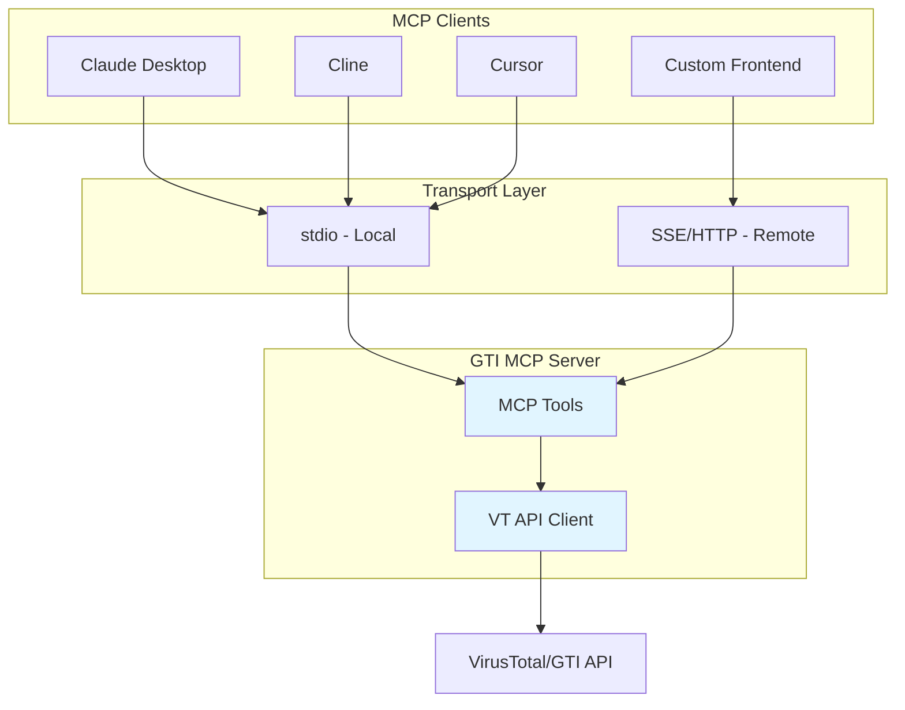
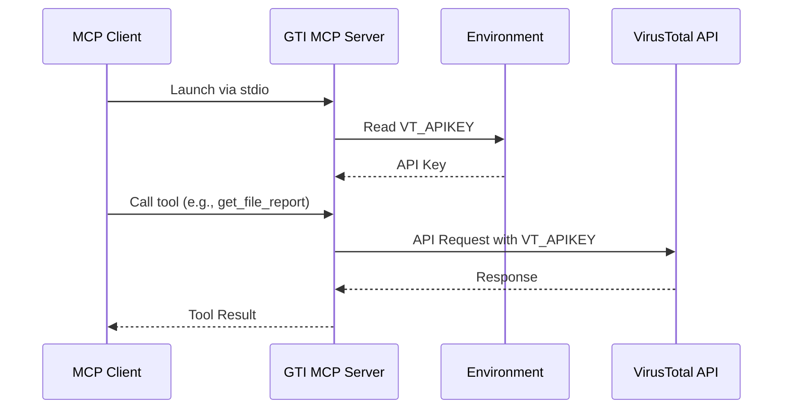
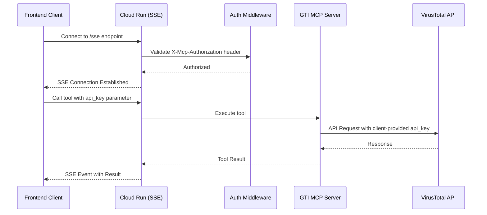

# Google Threat Intelligence MCP Server (Standalone)

This is a standalone MCP (Model Context Protocol) server for interacting with Google's Threat Intelligence suite. It provides AI assistants like Claude with access to comprehensive threat intelligence capabilities through both **local development** and **production cloud deployment** modes.

**Key Capabilities:**
- 🔍 Threat intelligence search (campaigns, threat actors, malware families)
- 📁 File analysis and behavior reports
- 🌐 Domain, IP, and URL reputation checking
- 🎯 IOC (Indicator of Compromise) search
- 📊 Threat profiles and hunting rulesets

[Learn more about MCP](https://modelcontextprotocol.io/introduction)

## Architecture

Understanding how GTI MCP Server works in different deployment modes:

### Component Overview



### Local Deployment Flow

For individual developers running the MCP server locally:



**API Key Management:** Server reads `VT_APIKEY` from environment variables at startup.

### Cloud Deployment Flow

For teams deploying a centralized service:



**API Key Management:** Clients pass `api_key` parameter with each tool call. Server authenticates connection via `MCP_AUTH_TOKEN` but uses client-provided API keys for VirusTotal requests.

**Security Note:** This architecture allows teams to deploy a shared MCP server while maintaining individual user API quotas and access controls.

## Features

### Collections (Threats)

- **`get_collection_report(id)`**: Retrieves a specific collection report by its ID (e.g., `report--<hash>`, `threat-actor--<hash>`).
- **`get_entities_related_to_a_collection(id, relationship_name, limit=10)`**: Gets related entities (domains, files, IPs, URLs, other collections) for a given collection ID.
- **`search_threats(query, limit=5, order_by="relevance-")`**: Performs a general search for threats (collections) using GTI query syntax.
- **`search_campaigns(query, limit=10, order_by="relevance-")`**: Searches specifically for collections of type `campaign`.
- **`search_threat_actors(query, limit=10, order_by="relevance-")`**: Searches specifically for collections of type `threat-actor`.
- **`search_malware_families(query, limit=10, order_by="relevance-")`**: Searches specifically for collections of type `malware-family`.
- **`search_software_toolkits(query, limit=10, order_by="relevance-")`**: Searches specifically for collections of type `software-toolkit`.
- **`search_threat_reports(query, limit=10, order_by="relevance-")`**: Searches specifically for collections of type `report`.
- **`search_vulnerabilities(query, limit=10, order_by="relevance-")`**: Searches specifically for collections of type `vulnerability`.
- **`get_collection_timeline_events(id)`**: Retrieves curated timeline events for a collection.

### Files

- **`get_file_report(hash)`**: Retrieves a comprehensive analysis report for a file based on its MD5, SHA1, or SHA256 hash.
- **`get_entities_related_to_a_file(hash, relationship_name, limit=10)`**: Gets related entities (domains, IPs, URLs, behaviours, etc.) for a given file hash.
- **`get_file_behavior_report(file_behaviour_id)`**: Retrieves a specific sandbox behavior report for a file.
- **`get_file_behavior_summary(hash)`**: Retrieves a summary of all sandbox behavior reports for a file hash.

### Intelligence Search

- **`search_iocs(query, limit=10, order_by="last_submission_date-")`**: Searches for Indicators of Compromise (files, URLs, domains, IPs) using advanced GTI query syntax.

### Network Locations (Domains & IPs)

- **`get_domain_report(domain)`**: Retrieves a comprehensive analysis report for a domain.
- **`get_entities_related_to_a_domain(domain, relationship_name, limit=10)`**: Gets related entities for a given domain.
- **`get_ip_address_report(ip_address)`**: Retrieves a comprehensive analysis report for an IPv4 or IPv6 address.
- **`get_entities_related_to_an_ip_address(ip_address, relationship_name, limit=10)`**: Gets related entities for a given IP address.

### URLs

- **`get_url_report(url)`**: Retrieves a comprehensive analysis report for a URL.
- **`get_entities_related_to_an_url(url, relationship_name, limit=10)`**: Gets related entities for a given URL.

### Hunting

- **`get_hunting_ruleset`**: Get a Hunting Ruleset object from Google Threat Intelligence.
- **`get_entities_related_to_a_hunting_ruleset`**: Retrieve entities related to the given Hunting Ruleset.

### Threat Profiles

- **`list_threat_profiles`**: List your Threat Profiles at Google Threat Intelligence.
- **`get_threat_profile(profile_id)`**: Get Threat Profile object.
- **`get_threat_profile_recommendations(profile_id, limit=10)`**: Returns the list of objects associated to the given Threat Profile.
- **`get_threat_profile_associations_timeline(profile_id)`**: Retrieves the associations timeline for the given Threat Profile.

## Quick Start (Local Development)

For developers who want to use GTI MCP Server with Claude Desktop, Cline, Cursor, or other MCP clients.

### Prerequisites

- Python 3.11 or higher
- [uv](https://docs.astral.sh/uv/) package manager
- VirusTotal API key ([get one free](https://www.virustotal.com/))

### Installation

```bash
# Clone the repository
git clone https://github.com/yourusername/gti-mcp-standalone.git
cd gti-mcp-standalone

# Install with uv (recommended)
uv tool install -e .

# Or run directly without installation
uv run gti_mcp
```

### API Key Setup

Set up the `VT_APIKEY` environment variable:

**macOS/Linux:**
```bash
export VT_APIKEY="your-virustotal-api-key"
```

**Windows PowerShell:**
```powershell
$Env:VT_APIKEY = "your-virustotal-api-key"
```

**Permanent setup (recommended):**

Add the export command to your shell profile (`~/.bashrc`, `~/.zshrc`, or `~/.bash_profile`):

```bash
echo 'export VT_APIKEY="your-virustotal-api-key"' >> ~/.zshrc
source ~/.zshrc
```

### MCP Client Configuration

#### Claude Desktop

Edit `~/.claude/claude_desktop_config.json`:

```json
{
  "mcpServers": {
    "gti": {
      "command": "uv",
      "args": [
        "--directory",
        "/absolute/path/to/gti-mcp-standalone",
        "run",
        "gti_mcp"
      ],
      "env": {
        "VT_APIKEY": "${VT_APIKEY}"
      }
    }
  }
}
```

**Note for macOS users:** If you installed `uv` using the standalone installer, use the full path to the uv binary (e.g., `/Users/yourusername/.local/bin/uv`) instead of just `uv`.

#### Cline

Edit `.cline/mcp.json` or use the settings UI:

```json
{
  "mcpServers": {
    "gti": {
      "command": "uv",
      "args": [
        "--directory",
        "/absolute/path/to/gti-mcp-standalone",
        "run",
        "gti_mcp"
      ],
      "env": {
        "VT_APIKEY": "${VT_APIKEY}"
      }
    }
  }
}
```

#### Cursor

Edit `.cursor/mcp.json`:

```json
{
  "mcpServers": {
    "gti": {
      "command": "uv",
      "args": [
        "--directory",
        "/absolute/path/to/gti-mcp-standalone",
        "run",
        "gti_mcp"
      ],
      "env": {
        "VT_APIKEY": "${VT_APIKEY}"
      }
    }
  }
}
```

### Verification

1. Restart your MCP client (Claude Desktop, Cline, or Cursor)
2. Check that the GTI server appears in the MCP tools list
3. Try a simple query: "Check the reputation of google.com using GTI"

If everything is working, you should see results from Google Threat Intelligence!
