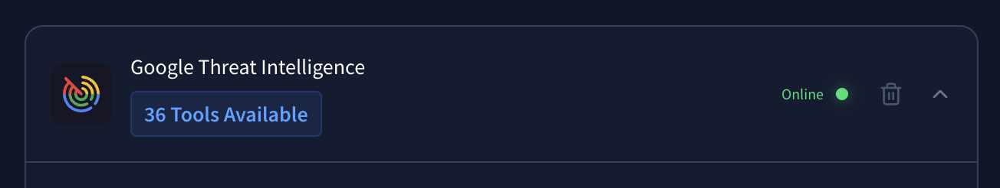
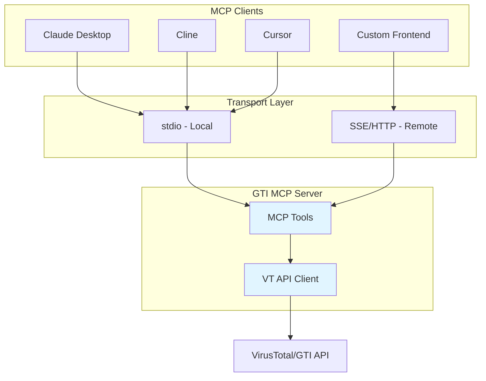
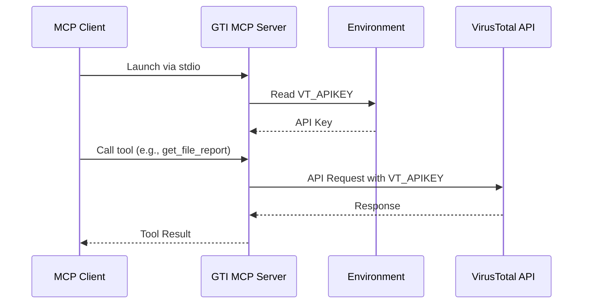
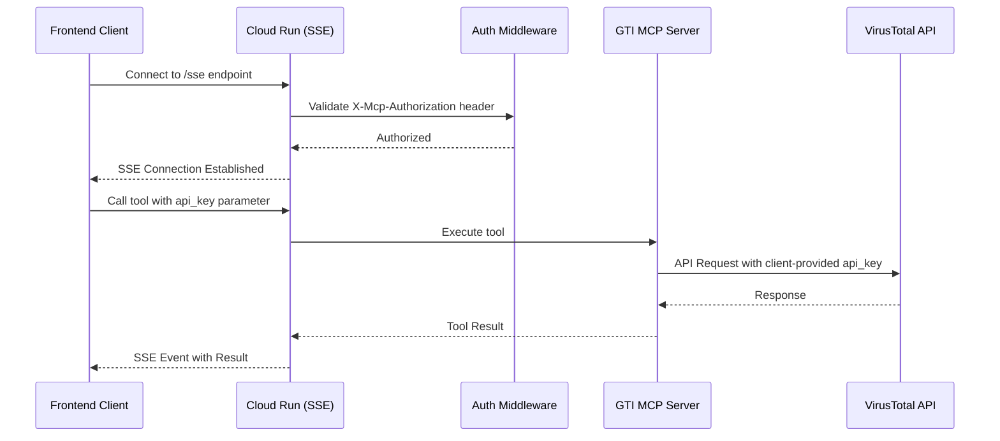

# Google Threat Intelligence MCP Server (Standalone)

This is a standalone MCP (Model Context Protocol) server for interacting with Google's Threat Intelligence suite. It provides AI assistants like Claude with access to comprehensive threat intelligence capabilities through both **local development** and **production cloud deployment** modes.



**Key Capabilities:**
- 🔍 Threat intelligence search (campaigns, threat actors, malware families)
- 📁 File analysis and behavior reports
- 🌐 Domain, IP, and URL reputation checking
- 🎯 IOC (Indicator of Compromise) search
- 📊 Threat profiles and hunting rulesets

[Learn more about MCP](https://modelcontextprotocol.io/introduction)

## Architecture

Understanding how GTI MCP Server works in different deployment modes:

### Component Overview



### Local Deployment Flow

For individual developers running the MCP server locally:



**API Key Management:** Server reads `VT_APIKEY` from environment variables at startup.

### Cloud Deployment Flow

For teams deploying a centralized service:



**API Key Management:** Clients pass `api_key` parameter with each tool call. Server authenticates connection via `MCP_AUTH_TOKEN` but uses client-provided API keys for VirusTotal requests.

**Security Note:** This architecture allows teams to deploy a shared MCP server while maintaining individual user API quotas and access controls.

## Features

### Collections (Threats)

- **`get_collection_report(id)`**: Retrieves a specific collection report by its ID (e.g., `report--<hash>`, `threat-actor--<hash>`).
- **`get_entities_related_to_a_collection(id, relationship_name, limit=10)`**: Gets related entities (domains, files, IPs, URLs, other collections) for a given collection ID.
- **`search_threats(query, limit=5, order_by="relevance-")`**: Performs a general search for threats (collections) using GTI query syntax.
- **`search_campaigns(query, limit=10, order_by="relevance-")`**: Searches specifically for collections of type `campaign`.
- **`search_threat_actors(query, limit=10, order_by="relevance-")`**: Searches specifically for collections of type `threat-actor`.
- **`search_malware_families(query, limit=10, order_by="relevance-")`**: Searches specifically for collections of type `malware-family`.
- **`search_software_toolkits(query, limit=10, order_by="relevance-")`**: Searches specifically for collections of type `software-toolkit`.
- **`search_threat_reports(query, limit=10, order_by="relevance-")`**: Searches specifically for collections of type `report`.
- **`search_vulnerabilities(query, limit=10, order_by="relevance-")`**: Searches specifically for collections of type `vulnerability`.
- **`get_collection_timeline_events(id)`**: Retrieves curated timeline events for a collection.

### Files

- **`get_file_report(hash)`**: Retrieves a comprehensive analysis report for a file based on its MD5, SHA1, or SHA256 hash.
- **`get_entities_related_to_a_file(hash, relationship_name, limit=10)`**: Gets related entities (domains, IPs, URLs, behaviours, etc.) for a given file hash.
- **`get_file_behavior_report(file_behaviour_id)`**: Retrieves a specific sandbox behavior report for a file.
- **`get_file_behavior_summary(hash)`**: Retrieves a summary of all sandbox behavior reports for a file hash.

### Intelligence Search

- **`search_iocs(query, limit=10, order_by="last_submission_date-")`**: Searches for Indicators of Compromise (files, URLs, domains, IPs) using advanced GTI query syntax.

### Network Locations (Domains & IPs)

- **`get_domain_report(domain)`**: Retrieves a comprehensive analysis report for a domain.
- **`get_entities_related_to_a_domain(domain, relationship_name, limit=10)`**: Gets related entities for a given domain.
- **`get_ip_address_report(ip_address)`**: Retrieves a comprehensive analysis report for an IPv4 or IPv6 address.
- **`get_entities_related_to_an_ip_address(ip_address, relationship_name, limit=10)`**: Gets related entities for a given IP address.

### URLs

- **`get_url_report(url)`**: Retrieves a comprehensive analysis report for a URL.
- **`get_entities_related_to_an_url(url, relationship_name, limit=10)`**: Gets related entities for a given URL.

### Hunting

- **`get_hunting_ruleset`**: Get a Hunting Ruleset object from Google Threat Intelligence.
- **`get_entities_related_to_a_hunting_ruleset`**: Retrieve entities related to the given Hunting Ruleset.

### Threat Profiles

- **`list_threat_profiles`**: List your Threat Profiles at Google Threat Intelligence.
- **`get_threat_profile(profile_id)`**: Get Threat Profile object.
- **`get_threat_profile_recommendations(profile_id, limit=10)`**: Returns the list of objects associated to the given Threat Profile.
- **`get_threat_profile_associations_timeline(profile_id)`**: Retrieves the associations timeline for the given Threat Profile.

## Quick Start (Local Development)

For developers who want to use GTI MCP Server with Claude Desktop, Cline, Cursor, or other MCP clients.

### Prerequisites

- Python 3.11 or higher
- [uv](https://docs.astral.sh/uv/) package manager
- VirusTotal API key ([get one free](https://www.virustotal.com/))

### Installation

```bash
# Clone the repository
git clone https://github.com/yourusername/gti-mcp-standalone.git
cd gti-mcp-standalone

# Install with uv (recommended)
uv tool install -e .

# Or run directly without installation
uv run gti_mcp
```

### API Key Setup

Set up the `VT_APIKEY` environment variable:

**macOS/Linux:**
```bash
export VT_APIKEY="your-virustotal-api-key"
```

**Windows PowerShell:**
```powershell
$Env:VT_APIKEY = "your-virustotal-api-key"
```

**Permanent setup (recommended):**

Add the export command to your shell profile (`~/.bashrc`, `~/.zshrc`, or `~/.bash_profile`):

```bash
echo 'export VT_APIKEY="your-virustotal-api-key"' >> ~/.zshrc
source ~/.zshrc
```

### MCP Client Configuration

#### Claude Desktop

Edit `~/.claude/claude_desktop_config.json`:

```json
{
  "mcpServers": {
    "gti": {
      "command": "uv",
      "args": [
        "--directory",
        "/absolute/path/to/gti-mcp-standalone",
        "run",
        "gti_mcp"
      ],
      "env": {
        "VT_APIKEY": "${VT_APIKEY}"
      }
    }
  }
}
```

**Note for macOS users:** If you installed `uv` using the standalone installer, use the full path to the uv binary (e.g., `/Users/yourusername/.local/bin/uv`) instead of just `uv`.

#### Cline

Edit `.cline/mcp.json` or use the settings UI:

```json
{
  "mcpServers": {
    "gti": {
      "command": "uv",
      "args": [
        "--directory",
        "/absolute/path/to/gti-mcp-standalone",
        "run",
        "gti_mcp"
      ],
      "env": {
        "VT_APIKEY": "${VT_APIKEY}"
      }
    }
  }
}
```

#### Cursor

Edit `.cursor/mcp.json`:

```json
{
  "mcpServers": {
    "gti": {
      "command": "uv",
      "args": [
        "--directory",
        "/absolute/path/to/gti-mcp-standalone",
        "run",
        "gti_mcp"
      ],
      "env": {
        "VT_APIKEY": "${VT_APIKEY}"
      }
    }
  }
}
```

### Verification

1. Restart your MCP client (Claude Desktop, Cline, or Cursor)
2. Check that the GTI server appears in the MCP tools list
3. Try a simple query: "Check the reputation of google.com using GTI"

If everything is working, you should see results from Google Threat Intelligence!

## Production Deployment (Cloud Run)

For teams who want to deploy a centralized GTI MCP service that multiple users or frontend applications can access via SSE (Server-Sent Events).

### Why Cloud Deployment?

- **Centralized service:** One deployment serves multiple users/applications
- **No local setup:** Users connect via HTTP/SSE without installing Python or dependencies
- **Team sharing:** Security teams can provide threat intelligence to multiple frontend apps
- **Scalability:** Cloud Run automatically scales based on demand

### Prerequisites

- Google Cloud Platform account with billing enabled
- [gcloud CLI](https://cloud.google.com/sdk/docs/install) installed and configured
- Project with Cloud Run API enabled

### Deployment Steps

#### 1. Clone the Repository

```bash
git clone https://github.com/yourusername/gti-mcp-standalone.git
cd gti-mcp-standalone
```

#### 2. Configure Deployment Script

Edit `gti-remotemcp-deploy.sh` and update the configuration section:

```bash
# Edit these three values:
PROJECT_ID="your-gcp-project-id"        # Find at console.cloud.google.com
SERVICE_NAME="gti-remotemcp-server"     # Name for your Cloud Run service
REGION="us-central1"                     # Your preferred region
```

#### 3. Run Deployment

```bash
chmod +x gti-remotemcp-deploy.sh
./gti-remotemcp-deploy.sh
```

The script will:
- Build the container using Google Cloud Buildpacks
- Deploy to Cloud Run
- Output the service URL and authentication token

#### 4. Save Deployment Information

The script outputs:
- **Service URL:** `https://gti-remotemcp-server-xyz.a.run.app`
- **SSE Endpoint:** `https://gti-remotemcp-server-xyz.a.run.app/sse`
- **Auth Token:** A randomly generated token for authentication

**Important:** Save the auth token securely! You'll need it to connect clients.

### Architecture Details

**Transport:** SSE (Server-Sent Events) over HTTP

**Authentication:**
- **Server access:** `X-Mcp-Authorization` header with `MCP_AUTH_TOKEN`
- **API calls:** `api_key` parameter passed with each tool invocation

**API Key Strategy:**
- Server does NOT store VirusTotal API keys
- Each tool call must include `api_key` parameter
- Allows per-user API quotas and access control
- Client applications manage API key distribution

### Security Considerations

1. **Protect the auth token:** Store `MCP_AUTH_TOKEN` securely (environment variables, secrets manager)
2. **HTTPS only:** Cloud Run enforces HTTPS by default
3. **API key handling:** Client applications should never expose VT API keys in frontend code
4. **Access control:** Consider adding additional authentication layers for production use
5. **Rate limiting:** VirusTotal enforces rate limits per API key

## Frontend Integration

For developers building custom frontend applications that connect to the deployed Cloud Run service.

### Connection Overview

- **Protocol:** SSE (Server-Sent Events) for events, HTTP POST for JSON-RPC messages
- **Transport:** `@modelcontextprotocol/sdk/client/sse`
- **Authentication:** Bearer-style token in `X-Mcp-Authorization` header
- **API Keys:** Pass `api_key` parameter with each tool call

### Configuration Parameters

1. **Service URL:** Your Cloud Run service URL + `/sse`
   - Example: `https://gti-remotemcp-server-xyz.a.run.app/sse`
2. **Auth Token:** The `MCP_AUTH_TOKEN` from deployment output
3. **VT API Key:** VirusTotal API key (managed client-side, passed per tool call)

### React/TypeScript Example

Complete implementation using the MCP SDK:

```typescript
import { Client } from "@modelcontextprotocol/sdk/client/index.js";
import { SSEClientTransport } from "@modelcontextprotocol/sdk/client/sse.js";

// Configuration (use environment variables in production)
const MCP_SERVER_URL = process.env.REACT_APP_MCP_SERVER_URL || "https://your-service.a.run.app/sse";
const MCP_AUTH_TOKEN = process.env.REACT_APP_MCP_AUTH_TOKEN || "your-auth-token";
const VT_API_KEY = process.env.REACT_APP_VT_API_KEY || "your-vt-api-key";

// Create SSE transport with authentication
const transport = new SSEClientTransport(
  new URL(MCP_SERVER_URL),
  {
    // Headers for SSE connection (GET request)
    eventSourceInit: {
      headers: {
        "X-Mcp-Authorization": MCP_AUTH_TOKEN,
      }
    },
    // Headers for JSON-RPC messages (POST requests)
    requestInit: {
      headers: {
        "X-Mcp-Authorization": MCP_AUTH_TOKEN,
      }
    }
  }
);

// Create MCP client
const client = new Client(
  {
    name: "gti-frontend-client",
    version: "1.0.0",
  },
  {
    capabilities: {
      tools: {},
      resources: {},
    },
  }
);

// Connect to server
async function connectToGTI() {
  try {
    await client.connect(transport);
    console.log("✅ Connected to GTI MCP Server");
    return true;
  } catch (error) {
    console.error("❌ Connection failed:", error);
    return false;
  }
}

// Example: Call a tool
async function checkFileReputation(fileHash: string) {
  try {
    const result = await client.callTool({
      name: "get_file_report",
      arguments: {
        hash: fileHash,
        api_key: VT_API_KEY  // ⚠️ Required: Pass API key with each call
      }
    });

    console.log("File report:", result);
    return result;
  } catch (error) {
    console.error("Tool call failed:", error);
    throw error;
  }
}

// Example: Search for threats
async function searchThreats(query: string) {
  try {
    const result = await client.callTool({
      name: "search_threats",
      arguments: {
        query: query,
        limit: 10,
        api_key: VT_API_KEY  // ⚠️ Required: Pass API key with each call
      }
    });

    console.log("Threat search results:", result);
    return result;
  } catch (error) {
    console.error("Search failed:", error);
    throw error;
  }
}

// Initialize
connectToGTI().then(success => {
  if (success) {
    // Example usage
    checkFileReputation("44d88612fea8a8f36de82e1278abb02f");
    searchThreats("APT28");
  }
});
```

### Important: API Key Handling

**Every tool call MUST include the `api_key` parameter:**

```typescript
const result = await client.callTool({
  name: "any_gti_tool",
  arguments: {
    // ... other tool-specific arguments ...
    api_key: VT_API_KEY  // ⚠️ Always required
  }
});
```

**Why?** The Cloud Run deployment does not store API keys. This allows:
- Per-user API quotas
- Individual access control
- Secure key management on client side

**Security Best Practices:**
- Never hardcode API keys in frontend code
- Use environment variables or secure configuration
- Consider backend proxy for additional security
- Implement proper key rotation policies

### CORS Considerations

The server allows cross-origin requests by passing `OPTIONS` requests through authentication middleware. If you encounter CORS issues:

1. Verify your request includes the `X-Mcp-Authorization` header
2. Check browser console for specific CORS errors
3. Ensure you're using HTTPS for the Cloud Run URL
4. Consider adding Starlette's `CORSMiddleware` if strict CORS enforcement is needed

### Troubleshooting

**Connection fails:**
- Verify service URL is correct (must end with `/sse`)
- Check `MCP_AUTH_TOKEN` matches deployment output
- Ensure Cloud Run service is running (`gcloud run services list`)

**Tool calls fail:**
- Verify `api_key` parameter is included in arguments
- Check VirusTotal API key is valid
- Review rate limits on your VirusTotal account

**Authentication errors:**
- Confirm `X-Mcp-Authorization` header is set correctly
- Check token hasn't been regenerated during redeployment

## Development

### Project Structure

```
.
├── gti_mcp/
│   ├── __init__.py
│   ├── server.py           # Main MCP server implementation
│   ├── utils.py            # VirusTotal API utilities
│   └── tools/              # Tool implementations
│       ├── __init__.py
│       ├── collections.py  # Threat collections tools
│       ├── files.py        # File analysis tools
│       ├── intelligence.py # IOC search tools
│       ├── netloc.py       # Domain/IP tools
│       ├── threat_profiles.py
│       └── urls.py         # URL analysis tools
├── tests/                  # Test suite
│   ├── conftest.py
│   ├── test_tools.py
│   ├── test_utils.py
│   └── test_files_errors.py
├── pyproject.toml          # Package configuration
├── Dockerfile              # Cloud Run container
├── gti-remotemcp-deploy.sh # Deployment script
└── README.md
```

### Running Tests

```bash
# Install test dependencies
uv pip install -e ".[test]"

# Run all tests
pytest

# Run with coverage
pytest --cov=gti_mcp

# Run specific test file
pytest tests/test_tools.py -v

# Run specific test
pytest tests/test_tools.py::test_get_file_report -v
```

### Contributing

To modify or extend this server:

1. **Fork and clone** the repository
2. **Create a feature branch**: `git checkout -b feature/your-feature`
3. **Make changes** in `gti_mcp/tools/` following existing patterns
4. **Add tests** in `tests/` for new functionality
5. **Run tests** to verify: `pytest`
6. **Update README** if adding new features or changing APIs
7. **Commit changes**: Use clear, descriptive commit messages
8. **Push and create PR** to the original repository

### Adding New Tools

Example pattern for adding a new tool:

```python
# In gti_mcp/tools/your_category.py

async def your_new_tool(param1: str, api_key: str) -> dict:
    """
    Tool description for MCP clients.

    Args:
        param1: Description of parameter
        api_key: VirusTotal API key (required for cloud deployment)

    Returns:
        Tool result as dictionary
    """
    import vt

    async with vt.Client(api_key) as client:
        result = await client.your_operation(param1)
        return result.to_dict()

# Register in gti_mcp/tools/__init__.py
```

## License & Attribution

This project is licensed under the **Apache License 2.0** - see the [LICENSE](LICENSE) file for details.

### Original Source

This is a standalone extraction of the Google Threat Intelligence MCP server from the official [mcp-security](https://github.com/google/mcp-security) repository.

**Original Authors:** Google SecOps Team
**Original Repository:** https://github.com/google/mcp-security
**Original License:** Apache 2.0

This standalone version is maintained independently but retains all original licensing and attribution.

### Third-Party Libraries

- [mcp](https://github.com/modelcontextprotocol/python-sdk) - Model Context Protocol SDK (MIT License)
- [vt-py](https://github.com/VirusTotal/vt-py) - VirusTotal Python SDK (Apache 2.0)
- [Starlette](https://www.starlette.io/) - ASGI framework (BSD License)
- [uvicorn](https://www.uvicorn.org/) - ASGI server (BSD License)

## Support

### Getting Help

- **Documentation:** This README and [MCP Protocol Docs](https://modelcontextprotocol.io/introduction)
- **Issues:** Report issues at the [original mcp-security repository](https://github.com/google/mcp-security/issues)
- **VirusTotal API:** [Official API documentation](https://developers.virustotal.com/reference/overview)

### Frequently Asked Questions

**Q: Do I need a paid VirusTotal account?**
A: No, a free VirusTotal account works. Note that free accounts have lower rate limits.

**Q: Can I use this with OpenAI or other LLM providers?**
A: Yes! This is an MCP server. Any MCP-compatible client can use it, not just Claude.

**Q: Is my API key secure in cloud deployment?**
A: The server never stores API keys. Clients pass them per-call, allowing you to implement your own key management strategy.

**Q: Can I deploy to platforms other than Cloud Run?**
A: Yes! The included Dockerfile works with any container platform (AWS ECS, Azure Container Instances, etc.). Cloud Run is just the default.

**Q: What's the difference between this and the original mcp-security repo?**
A: This is a standalone extraction of just the GTI component, making it easier to deploy independently. The original repo contains multiple security tools.

---

**Built with ❤️ using [Model Context Protocol](https://modelcontextprotocol.io/)**

