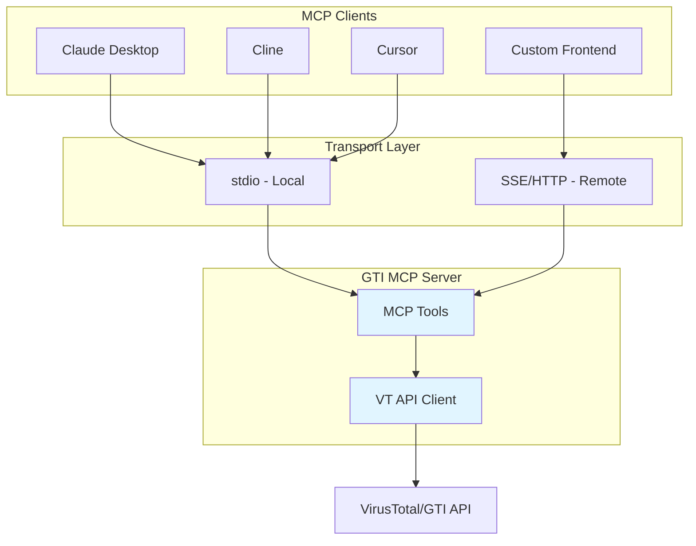
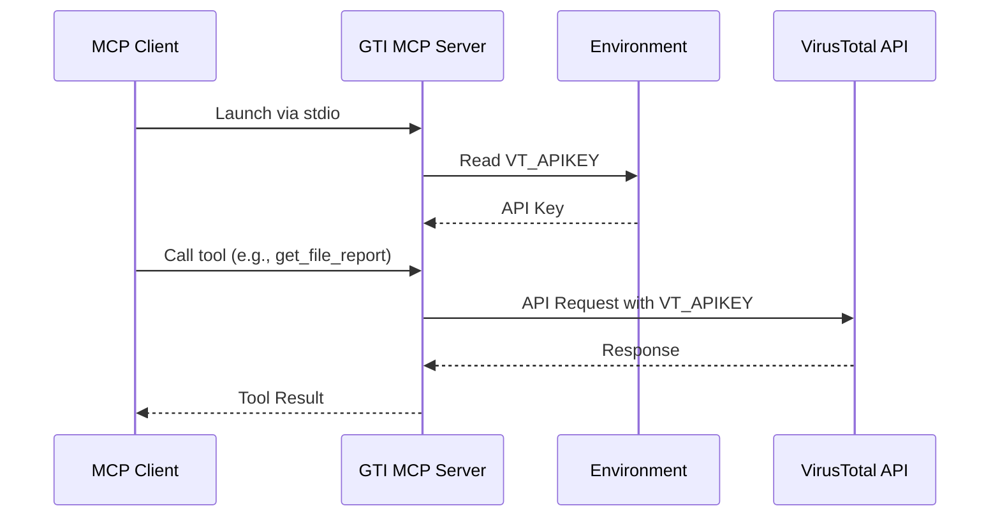
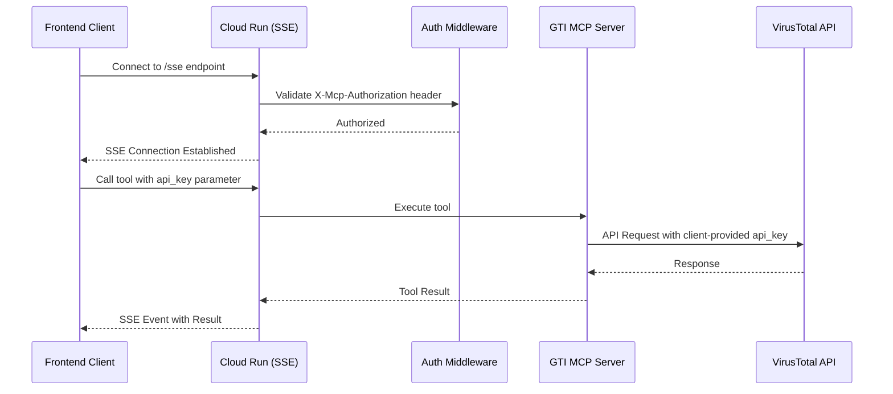

# Google Threat Intelligence MCP Server (Standalone)

This is a standalone MCP (Model Context Protocol) server for interacting with Google's Threat Intelligence suite. It provides AI assistants like Claude with access to comprehensive threat intelligence capabilities through both **local development** and **production cloud deployment** modes.

**Key Capabilities:**
- 🔍 Threat intelligence search (campaigns, threat actors, malware families)
- 📁 File analysis and behavior reports
- 🌐 Domain, IP, and URL reputation checking
- 🎯 IOC (Indicator of Compromise) search
- 📊 Threat profiles and hunting rulesets

[Learn more about MCP](https://modelcontextprotocol.io/introduction)

## Architecture

Understanding how GTI MCP Server works in different deployment modes:

### Component Overview

### Local Deployment Flow

For individual developers running the MCP server locally:

**API Key Management:** Server reads `VT_APIKEY` from environment variables at startup.

### Cloud Deployment Flow

For teams deploying a centralized service:

**API Key Management:** Clients pass `api_key` parameter with each tool call. Server authenticates connection via `MCP_AUTH_TOKEN` but uses client-provided API keys for VirusTotal requests.

**Security Note:** This architecture allows teams to deploy a shared MCP server while maintaining individual user API quotas and access controls.
